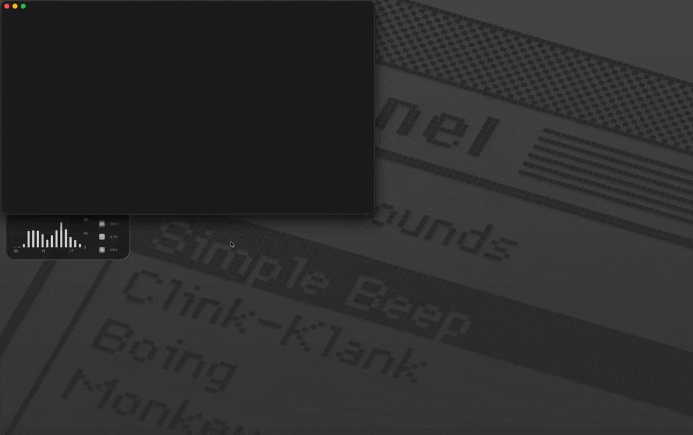

# 📝 Playdown

[](https://github.com/z-alamsyah/playdown/releases)
[](https://github.com/z-alamsyah/playdown/releases/latest)
[](https://github.com/z-alamsyah/playdown/stargazers)
[](LICENSE)

A lightweight **workbench for agentic workflows**: the markdown your agents read and write, and the terminals they run in — side by side. Works with **any coding agent**, because Playdown remotes the terminal, not the harness.

<!-- TODO: hero demo GIF here (assets/demo.gif) -->


## What is this?

Playdown puts the two halves of agent-driven work in one light window: the markdown that steers agents (PRDs, skills, specs, manifests) and the terminal sessions the agents actually run in. Review a spec, annotate it like a PR, send the feedback to the agent in the built-in terminal, watch the files reload as it edits. It's built for people who live in markdown and terminals all day — and it's harness-agnostic: Claude Code, Cursor CLI, aider, opencode, or any CLI agent works, because everything (including phone remote and Telegram alerts) operates at the terminal/PTY level.

| | Playdown | Typical code editor |
|---|---|---|
| App bundle | ~5 MB | 100+ MB |
| RAM (idle) | ~70–100 MB | 300–500+ MB |
| Startup | < 0.5s | 1–3s |

🌐 **[Landing page & download →](https://z-alamsyah.github.io/playdown/)**

## Install

### macOS / Linux — one line (recommended)

```bash
curl -fsSL https://raw.githubusercontent.com/z-alamsyah/playdown/main/install.sh | bash
```

- **macOS:** installs the `.dmg` to `/Applications`, clears the quarantine flag (unsigned), launches it, and adds the `playdown` command.
- **Linux:** installs the `.deb` (Debian/Ubuntu/**WSL**), `.rpm` (Fedora), or falls back to the AppImage in `~/.local/bin`. The `playdown` command works from your shell.

### macOS — manual (.dmg)

1. Download the latest `.dmg` from [Releases](https://github.com/z-alamsyah/playdown/releases/latest).
2. Open it, drag **Playdown** → **Applications**.
3. First launch only: right-click **Playdown** → **Open** (it's unsigned, so Gatekeeper asks once).

### Linux / WSL notes

- Needs `libwebkit2gtk-4.1` (the `.deb`/`.rpm` pull it in automatically).
- **WSL:** GUI apps need **WSLg** (Windows 11 / recent Windows 10). Run `wsl --update` if the window doesn't appear.

### Windows

Download the `.msi` or `.exe` from [Releases](https://github.com/z-alamsyah/playdown/releases/latest).
(The terminal and remote bridge are macOS/Linux for now.)

### From source

```bash
git clone https://github.com/z-alamsyah/playdown.git
cd playdown
pnpm install
pnpm tauri build      # bundle for your OS
# or: pnpm tauri dev   # run in dev mode
```

## Features

**The workbench:**

- 🖥️ **Built-in multi-session terminal** — real PTYs (new / switch / rename / kill), dockable bottom or right side-by-side with the editor, resizable, `` Ctrl+` `` to toggle. xterm.js lazy-loaded — zero cost until opened. "New agent terminal" in the command palette starts a session with your configured agent command.
- 💬 **Annotate → send to your agent** — flip on Annotate (`⌘⇧A`, forces preview), click any block in the rendered markdown, leave a comment; each note is quoted and anchored to its source line and persists per file. **Copy as prompt** exports every annotated file's notes as one prompt; **Send to terminal** pastes it into the *active* terminal session (bracketed paste — multi-line prompts don't self-execute) and clears the annotations. Notes anchor by line number, so heavy edits above them can drift older notes.
- 📊 **Agents at a glance** — every terminal tab shows live status derived from PTY signals: spinner = working, red = needs you, green = done. OS notification when a background agent blocks or finishes; status bar totals across sessions.
- 📱 **Remote access (phone + Telegram)** — the optional [playdown-remote](https://github.com/z-alamsyah/playdown-remote) companion streams your sessions to a phone browser and a Telegram bot. **Works with any coding agent: it remotes the terminal, not the harness.** See [Remote access](#remote-access-phone--telegram).
- 🔄 **Auto-reload** — files edited outside (say, by an agent) refresh in place; unsaved work is never clobbered.
- 🧬 **Git-aware** — gutter marks added/changed/deleted lines vs HEAD; click for a side-by-side diff. Compare any two files.

**The editor:**

- 📂 **Folder tree** — open a folder (or drag one onto the window); all files including dotfiles, nested indent guides, drag-and-drop to move, Finder/file-manager drops to import
- 🗂️ **Tabs & split panes** — drag tabs to reorder, move between groups, or split to any edge (VSCode-style, nested, resizable); `⌘\` splits right
- ✏️ **Edit ⇄ Preview** — per-pane toggle; edit left, live preview right
- 🔎 **Quick Open** (`⌘P`), **global search** across file contents (`⌘⇧F`), **find/replace** in the editor (`⌘F`), **go to line** (`⌘G`)
- ⚡ **Command palette** (`⌘⇧P`) — every action, keybinding, and recent folder
- 🧭 **Outline**, 🧩 **frontmatter-aware** (foldable in editor, metadata card in preview), ✨ **GFM**, 🧜 **Mermaid** (lazy-loaded)
- 🔡 **JSON tools** — format (`⇧⌥F`), minify (`⌘⇧M`), optional key sorting, parse errors pointed at the exact line
- 🖼️ **Image preview** — png/jpg/gif/webp/svg/bmp/ico/avif inline; `.html` files open in your browser
- 🗃️ **File ops** — new file/folder, rename, delete to Trash, copy full/relative path
- ⌨️ **`playdown` CLI** — `playdown .` opens a folder from your shell; `--update` pulls the latest release
- 🪟 **Multi-window** (File ▸ New Window) with per-window titlebar colors, 🔍 **zoom**, ⚙️ **settings** (`⌘,`) with fully rebindable shortcuts, 🌗 **GitHub-style dark/light themes**, session persisted across restarts

**The deal:**

- 🆓 **Free forever** — no sign-in, no telemetry, no subscription. Open source (MIT).

## Remote access (phone + Telegram)

Left the desk while an agent works? Three steps:

1. Playdown → **Settings → Terminal & agents → Remote access: On**
   (Playdown runs the companion for you and shows the QR right in Settings.)
2. If the companion isn't installed yet:
   ```bash
   curl -fsSL https://raw.githubusercontent.com/z-alamsyah/playdown-remote/main/install.sh | sh
   ```
3. Scan the QR — same Wi-Fi, or anywhere via [Tailscale](https://tailscale.com) (direct WireGuard, no relay, no cloud, no account).

You get a mobile web terminal — sessions grouped by agent status (needs-you / working / done / idle) with a TUI-friendly key bar — and an optional **Telegram bot** (`--telegram <token>`) that pings you when an agent blocks or finishes, with inline Enter/Esc/1/2/3 keys to answer from the notification.

The design is harness-agnostic on purpose: the bridge forwards raw PTY bytes and terminal-level signals, so any CLI agent — or plain `vim` — works unmodified. The socket contract is documented in [`BRIDGE_PROTOCOL.md`](BRIDGE_PROTOCOL.md); build your own companion on it. Requires Playdown ≥ 0.13.0 (macOS/Linux).

## Keyboard shortcuts

All shortcuts are rebindable in Settings (`⌘,`). Defaults:

| Shortcut | Action |
|---|---|
| `⌘P` | Quick open (find file) |
| `⌘⇧F` | Search in files |
| `⌘⇧P` | Command palette |
| `⌘F` | Find / replace in editor |
| `⌘G` | Go to line |
| `⌘O` | Open folder |
| `⌘S` | Save |
| `⌘E` | Toggle edit / preview |
| `⌘⇧A` | Toggle annotate mode |
| `⌘\` | Split right |
| `⌘B` | Toggle sidebar |
| `⌘⇧O` | Toggle outline |
| `⇧⌥F` | Format document (JSON) |
| `⌘⇧M` | Minify JSON |
| `` Ctrl+` `` | Toggle terminal |
| `⌘T` | New terminal session |
| `⌘X` | Close terminal session |
| `⌘J` | Focus editor ⇄ terminal |
| `⌘⌥↓` / `⌘⌥↑` | Next / previous terminal session |
| `⌘W` | Close tab |
| `⌘⌥W` | Close other tabs |
| `⌘⇧W` | Close all tabs |
| `⌘1`–`⌘9` | Select tab |
| `Ctrl+Tab` / `Ctrl+⇧+Tab` | Cycle tabs |
| `⌘⌥←` / `⌘⌥→` | Focus previous / next split group |
| `⌘=` / `⌘-` / `⌘0` | Zoom in / out / reset |
| `⌘,` | Settings |

## Development

Prerequisites: [Node.js](https://nodejs.org) + [pnpm](https://pnpm.io) + [Rust](https://rustup.rs).

```bash
pnpm install
pnpm tauri dev      # run the app in dev mode
pnpm tauri build    # produce a distributable bundle (.app / .dmg / …)
```

### Self-host the landing page (Docker)

```bash
cp .env.example .env            # set DOCKERHUB_USER
docker compose build            # nginx:alpine + docs/ (multi-arch friendly)
docker compose push             # → Docker Hub
# on the server (e.g. a Jetson / any arm64 or amd64 box):
docker run -d --restart unless-stopped -p 8080:80 <user>/playdown-site:latest
```

## Tech

- **Shell:** Tauri v2 (Rust core, system WebView — no bundled Chromium)
- **UI:** Svelte 5 + Vite + TypeScript
- **Editor:** CodeMirror 6
- **Rendering:** markdown-it + highlight.js + mermaid

## License

MIT — see [LICENSE](LICENSE).

## Attribution & forks

Playdown is open source — fork, clone, and modify away. A few asks:

- **Keep the notice.** The MIT license requires derivative works to retain the copyright and license text (`Copyright (c) 2026 z-alamsyah`). See [NOTICE](NOTICE).
- **Rename your fork.** The license covers the *code*, not the brand. **"Playdown"** and its logo are trademarks of z-alamsyah — please ship modified versions under a different name and don't use the Playdown logo as your app's primary mark.
- **Credit the origin.** You're encouraged to state your project is **"based on Playdown"** (or *a fork of Playdown*), linking back to <https://github.com/z-alamsyah/playdown>.

> **No telemetry, ever.** The app phones nothing home. Usage is gauged only from public GitHub release **download counts** ([shields badge](https://github.com/z-alamsyah/playdown/releases) above).
