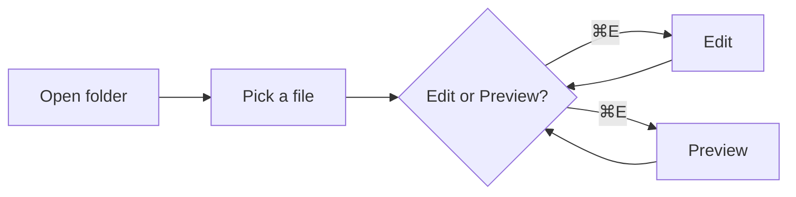

# Welcome to Playdown 📝

A **lightweight** markdown editor & viewer. Toggle edit/preview with `⌘E`.

## GitHub-flavored markdown

### Task list

- [x] Open a folder
- [x] Browse the file tree
- [ ] Write some markdown
- [ ] Toggle to preview

### Table

| Feature      | Status | Notes                  |
| ------------ | ------ | ---------------------- |
| Folder tree  | ✅     | recursive              |
| Tabs         | ✅     | multi-file             |
| Frontmatter  | ✅     | card + fold            |
| Mermaid      | ✅     | lazy-loaded            |

### Code block

```rust
#[tauri::command]
fn read_file(path: String) -> Result<String, String> {
    std::fs::read_to_string(&path).map_err(|e| e.to_string())
}
```

```typescript
export const render = (source: string): string => md.render(source);
```

## Mermaid diagram



## Blockquote

> Markdown all day, without the IDE tax.

[Visit the Tauri site](https://tauri.app)
